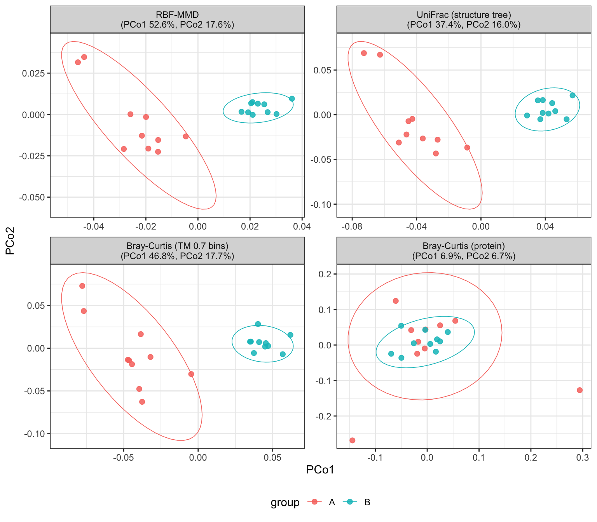

# repdist

**Measure, analyze and compare protein representation distances**

`repdist` represents each sample as an abundance-weighted distribution over
protein embeddings and compares samples with maximum mean discrepancy
(MMD), giving a beta-diversity metric that is aware of protein representation
similarity rather than exact sequence identity alone.

The package use `TM-Vec` by default, which the protein and sample level embedding
distances represent structural differences. The cosine distance between a pair of 
protein embeddings is defined as an approximation of the TM-score.



Two groups of simulated samples differing by *function*, carried on
non-overlapping homologs. MMD, a structure tree and structural bins all separate
them; protein-level Bray-Curtis, which can only ask whether two samples hold the
same accession, sees nothing. Built in `vignette("simulation", package = "repdist")`.

## Install

```r
if (!requireNamespace("remotes", quietly = TRUE))
    install.packages("remotes")
remotes::install_github("Yixuan39/repdist")
```

## Quick start

```r
library(repdist)

seqs <- read_fasta("proteins.fasta")
Z <- embed_proteins(seqs, model = "tmvec")

# Beta diversity between samples
D <- sample_repdist(counts, Z)
vegan::adonis2(D ~ condition, data = meta)

# Structure-level protein clusters, e.g. for biomarker discovery
G <- repdist_matrix(Z)                    # 1 - predicted TM-score
bins <- bin_proteins(G, min_sim = 0.7)
```

`bin_proteins()` cuts a complete-linkage tree, so every pair inside a bin meets
`min_sim`. Structural similarity alone does not guarantee shared function, so
compare annotation agreement with coverage and fragmentation before
transferring labels.

## License

MIT
