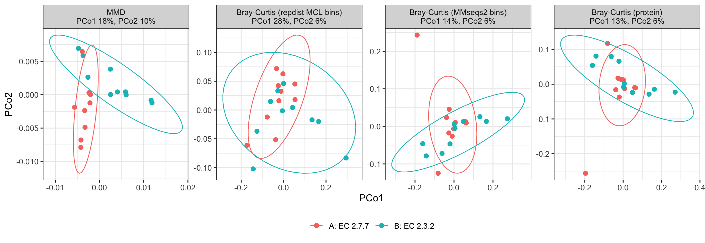

# repdist

**Measure, analyze and compare protein representation distances**

`repdist` represents each sample as an abundance-weighted distribution over
protein embeddings and compares samples with maximum mean discrepancy
(MMD), giving a beta-diversity metric that is aware of protein representation
similarity rather than exact sequence identity alone. The same embeddings also
cluster proteins into structural bins by Markov clustering (MCL).

The default `TM-Vec` model predicts structural similarity: cosine similarity
between protein embeddings approximates the TM-score. The corresponding cosine
distance is `1 - similarity`.



Two groups of ten simulated samples, enriched for different enzyme classes
(EC 2.7.7 and EC 2.3.2) with 2% of their abundance. Every sample carries its
enrichment through proteins from MMseqs2 sequence clusters (50% identity) that
no other sample of its group uses, so no accession or sequence cluster is
shared. Ellipses are 95% ellipses per group. PERMANOVA and PERMDISP, 999
permutations:

| Distance | PERMANOVA R² | PERMANOVA p | PERMDISP p |
| --- | --- | --- | --- |
| MMD | 0.115 | 0.001 | 0.704 |
| Bray-Curtis (repdist MCL bins) | 0.061 | 0.207 | 0.220 |
| Bray-Curtis (MMseqs2 bins) | 0.054 | 0.263 | 0.487 |
| Bray-Curtis (protein) | 0.055 | 0.222 | 0.549 |

Under such sequence-disjoint functional contrasts, MMD's graded
representation similarity keeps the relationship that protein identity and
hard sequence bins discard. This is one of 28 contrasts in the
[sequence-disjoint simulation](https://yixuan39.github.io/repdist/simulation_ec.html)
on the package website.

## Install

After acceptance into Bioconductor:

```r
if (!requireNamespace("BiocManager", quietly = TRUE))
    install.packages("BiocManager")
BiocManager::install("repdist")
```

Until then, install the development version with Bioconductor dependencies:

```r
if (!requireNamespace("BiocManager", quietly = TRUE))
    install.packages("BiocManager")
BiocManager::install(c("basilisk", "BiocFileCache", "BiocParallel",
    "Biostrings", "pwalign", "rhdf5", "S4Vectors", "MCL"))
if (!requireNamespace("remotes", quietly = TRUE))
    install.packages("remotes")
remotes::install_github("Yixuan39/repdist")
```

## Quick start

```r
library(repdist)

proteins <- embed_proteins("proteins.fasta", model = "tmvec")
# or, from the tmvec command-line tool:
# proteins <- read_embeddings("db/proteins.npz", seqs = "proteins.fasta")

# Beta diversity between samples
D <- sample_mmd(counts, proteins)
vegan::adonis2(D ~ condition, data = meta)

# Structure-level protein clusters, e.g. for biomarker discovery
S <- protein_similarity(proteins, min_sim = 0.7, min_coverage = 0.5)
bins <- bin_proteins(S, inflation = 2)
bin_counts <- bin_glom(counts, bins) # samples x bins
```

`proteins` is an `AAStringSet` of the sequences with the embeddings in
`mcols(proteins)$embedding`. `protein_similarity()` sets pairs below `min_sim` to 0,
and pairs whose alignment covers less than `min_coverage` of either sequence.
`bin_proteins()` runs MCL on the remaining edges. The floor applies to edges,
not all pairs: a bin can hold pairs below it. Structural similarity alone does
not guarantee shared function, so weigh annotation agreement against how much of the catalog the
non-singleton bins hold, and how far families fragment, before transferring
labels.

## License

Package code: MIT. Example data: CC BY 4.0; see
[the data provenance and attribution](inst/scripts/DATA_PROVENANCE.md).
