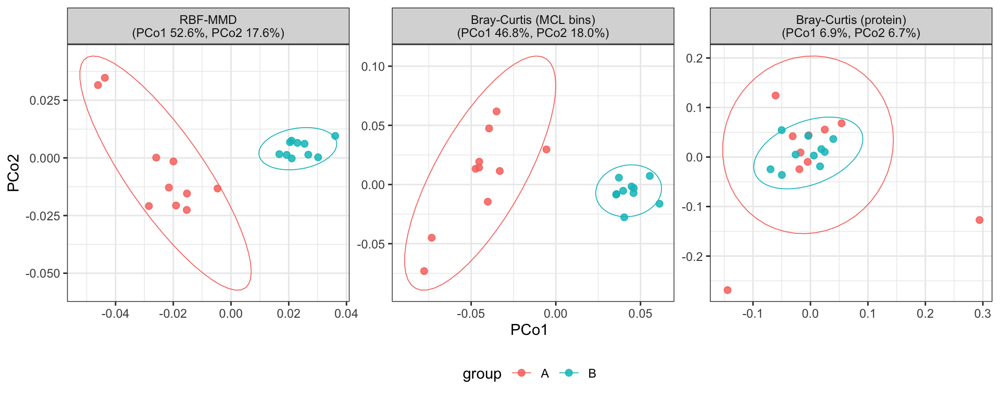

<style>
.main-container img { max-width: 620px; display: block; margin: 1.5em auto 0.5em; }
.caption-note { color: #b52b27; }
</style>

`repdist` measures the distance between proteins in a frozen protein language
model's representation space and uses it twice:

1. **Between samples.** Each sample is an abundance-weighted distribution
   over protein embeddings, compared by maximum mean discrepancy
   (`sample_mmd()`).
2. **Between proteins.** Pairs above a similarity and alignment-coverage
   floor form a sparse graph (`protein_similarity()`), Markov clustering
   splits it into bins (`bin_proteins()`), and the bins' summed counts
   (`bin_glom()`) go to differential abundance.

The default representation is **TM-Vec**, whose cosine similarity
approximates the TM-score of two structures. Two communities can run the same
reaction on accessions that never overlap; an identity-based comparison
cannot see that, and a structure-aware one can when the proteins share
structure.



<span class="caption-note">Two groups of simulated samples differing by
function, carried on non-overlapping homologs.</span> MMD and MCL bins both
separate them; protein-level Bray-Curtis, which can only ask whether two
samples hold the same accession, sees nothing.

# The method, then the data

**[Simulation](simulation.html)** — the methodological test. Ten CATH
FunFams, every protein in every sample, and a functional shift carried by
accessions no two samples share: RBF-MMD, Bray-Curtis on MCL bins and
protein-level Bray-Curtis, by PERMANOVA and PCoA. The
[benchmark over experimentally characterised enzyme classes
(EC3)](validation/benchmark_report.html) repeats the test with every EC3 as
the target.

**[Real-data validation](case_study.html)** — the same workflow on the full
mouse faecal metaproteome of Blakeley-Ruiz *et al.*, *ISME J* **19**(1)
wraf048: six dietary protein sources, 19,171 proteins. MMD beta diversity,
MCL bins at the package defaults, DESeq2 on the bins, and a functional
reading of the most responsive annotated bins. The [full-catalog
run](validation/case_study1_report.html) adds the file readers,
KEGG function on the embedding map, and run time and memory at this size.

# Installation

`repdist` is an R package. Install the development version from GitHub:

```r
if (!requireNamespace("remotes", quietly = TRUE))
    install.packages("remotes")
remotes::install_github("Yixuan39/repdist")
```

Embeddings run through a pinned `basilisk` Python environment, so no manual
Python setup is needed.

```r
library(repdist)

x <- embed_proteins("proteins.fasta", model = "tmvec")

D <- sample_mmd(counts, x)                # RBF-MMD between samples
vegan::adonis2(D ~ condition, data = meta)

S <- protein_similarity(x, min_sim = 0.7, min_coverage = 0.5)
bins <- bin_proteins(S, inflation = 2)
bin_glom(counts, bins)                    # samples x bins
```

`protein_similarity()` keeps a pair as an edge only above `min_sim` and when
the alignment covers at least `min_coverage` of both sequences;
`bin_proteins()` runs MCL on those edges. The floor applies to edges, not all
pairs: a bin can hold pairs below it. `vignette("repdist")` tours the
functions.

# Reproducing

Every page's source sits beside `index.Rmd` at the root of the
[`gh-pages` branch](https://github.com/Yixuan39/repdist/tree/gh-pages);
`rmarkdown::render_site()` rebuilds them with the installed `repdist`.

```
simulation.Rmd      # reads validation/funfam_universe.rds
data_curation.Rmd   # -> data/test_study/ps.rds
case_study.Rmd      # reads ps.rds and cached TM-Vec embeddings
validation/         # EC3 benchmark and full-catalog run, with their reports
```

The simulation page needs only the package and `validation/funfam_universe.rds`;
`validation/README.md` describes that universe and the EC3 benchmark.
The real-data pages read `data/test_study/` relative to the working
directory, and `data_curation.Rmd` must run first. Those study inputs are not
redistributed here; the curation page names the files and the accession they
come from.

# Source

Package source, issues and the vignette are at
[github.com/Yixuan39/repdist](https://github.com/Yixuan39/repdist). This site is
built from the repository's `gh-pages` branch. Released under MIT.
